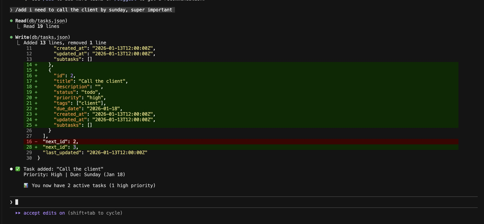

# PromptStack

*What if your backend was just markdown files and Claude Code ran it?*

**Build full-stack apps with just text files.**

PromptStack is a framework that uses Claude Code to build apps with just text files. Your APIs are commands, your business logic is markdown, your database is JSON. Claude Code acts as both the backend runtime and the CLI frontend. No code, no infrastructure, no deployment.



---

## Core Insight

**Claude Code apps are executable specifications.**

The natural language instructions ARE the spec, and the LLM is the interpreter. There's no translation step between "what you want" and "what runs."

> *The spec IS the implementation.*

---

## Everything is Text

Every part of your app is just text:

| Component | Format | Example |
|-----------|--------|---------|
| API Endpoints | Markdown commands | `.claude/commands/add.md` |
| Database | JSON files | `db/tasks.json` |
| Business Logic | Markdown instructions | `CLAUDE.md` |
| Middleware | Python/Bash hooks | `.claude/hooks/validate.py` |
| Microservices | Markdown agents | `.claude/agents/planner.md` |
| Libraries | Markdown skills | `.claude/skills/productivity/SKILL.md` |

Claude Code becomes your runtime. You write text, it executes.

```
my-app/
├── CLAUDE.md              # Your business logic
├── .claude/commands/      # Your API endpoints
├── .claude/hooks/         # Your middleware
└── db/                    # Your database
```

---

## The Efficiency Tradeoff

Let's be honest: this approach is computationally inefficient.

- Reading a JSON file costs tokens
- Every operation involves LLM reasoning
- There's latency on every action

**But consider:**
- LLM costs are dropping rapidly
- Claude Code handles the infrastructure complexity
- Development time is far more expensive than compute
- MVP validation matters more than efficiency

The tradeoff: **Expensive compute, cheap development.**

---

## The Flip: AI Comes for Free

But here's what's interesting.

In traditional development:
- Standard APIs = easy (but require code)
- AI features = hard (require ML infrastructure, pipelines, model hosting)

In PromptStack:
- Standard APIs = just text
- AI features = also just text

This isn't the main reason to use PromptStack - the main reason is that everything is text and you get a working app immediately. But it's a nice bonus that complex AI features are native and free.

---

## Example: Task Manager

A complete task manager in a few text files:

**Commands (your API):**
```
.claude/commands/
├── add.md      # POST /tasks
├── list.md     # GET /tasks
├── done.md     # PATCH /tasks/:id
└── edit.md     # PUT /tasks/:id
```

**Data (your database):**
```
db/
├── tasks.json
├── completed.json
└── patterns.json
```

**That's it.** No Express server. No database setup. No ORM.

```bash
claude
> /add Buy groceries - high priority, due tomorrow
> /list
> /done buy groceries
```

### Adding AI Features

Want smart suggestions? Create a file:

```markdown
# .claude/commands/suggest.md

Analyze all tasks and recommend what to work on next.
Consider: priority, deadlines, how long the task has been waiting.
Explain your reasoning.
```

That's all you need to get started. No ML pipeline. No model hosting. No API integration.

---

## Two Architecture Levels

### Minimal (commands only)

```
my-app/
├── CLAUDE.md           # All logic here
├── .claude/commands/   # Your commands
└── db/                 # Your data
```

### Extended (agents + skills)

```
my-app/
├── CLAUDE.md           # Core identity
├── .claude/
│   ├── commands/       # Entry points
│   ├── agents/         # Specialized workers
│   └── skills/         # Reusable knowledge
└── db/
```

---

## Get Started

```bash
# Copy the example
cp -r examples/smart-task-manager my-app
cd my-app

# Start Claude Code
claude

# You now have a working app
> /add Try out PromptStack
> /list
```

---

## Documentation

- [Reference](docs/REFERENCE.md) - Commands, data, agents, skills, hooks

## Examples

- [Smart Task Manager](examples/smart-task-manager/) - Full example with CRUD + AI features

---

## Requirements

- [Claude Code](https://code.claude.com/docs/en/overview) CLI

That's it. No servers. No databases. No deployment.

---

*PromptStack: The backend that fits in a README.*
